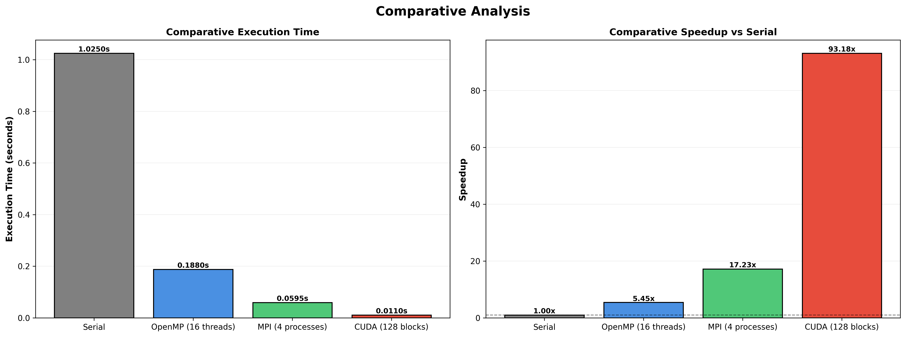
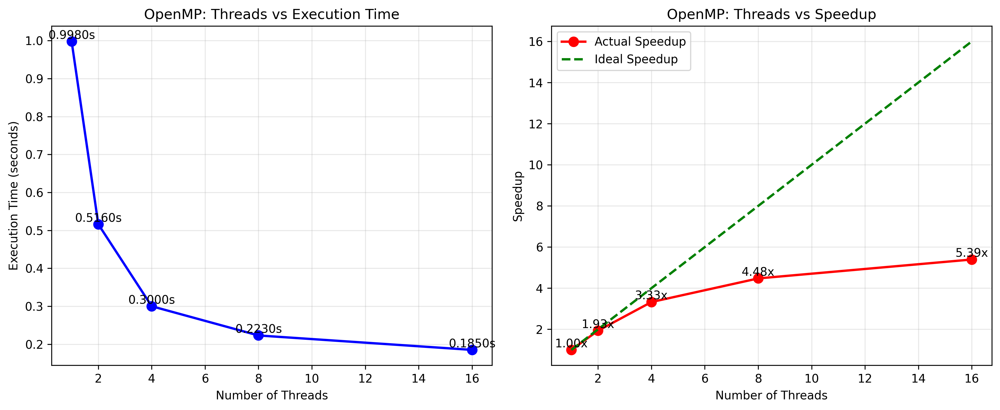
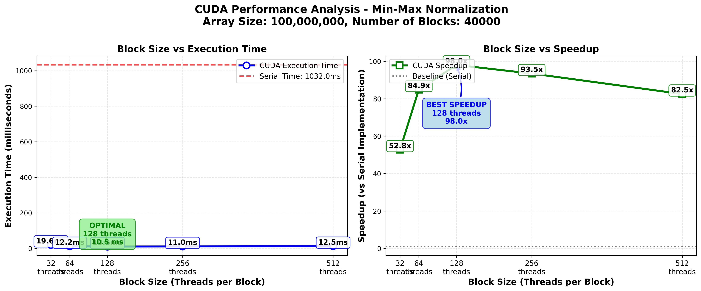

# Parallel Min-Max Normalization Suite 🚀

A comprehensive parallel computing project implementing **Min-Max Normalization** (Data Preprocessing) across multiple parallel programming paradigms: **OpenMP**, **MPI**, and **CUDA**. This project demonstrates performance optimization, scalability analysis, and comparative evaluation of different parallel computing approaches.

## 🎯 Overview

This project implements **parallel Min-Max Scaling** (normalization) using three major parallel computing paradigms:

1. **OpenMP** - Shared-memory parallelism using multi-threading
2. **MPI** - Distributed-memory parallelism using message-passing
3. **CUDA** - GPU parallelism using NVIDIA CUDA

### What is Min-Max Normalization?

Min-Max normalization is a data preprocessing technique that scales features to a fixed range [0, 1] using the formula:

$$X_{normalized} = \frac{X - X_{min}}{X_{max} - X_{min}}$$

This technique is essential for:
- Machine learning preprocessing
- Data standardization
- Feature scaling for neural networks
- Statistical analysis

## ✨ Key Features

✅ **Multiple Implementations**: Serial, OpenMP, MPI, and CUDA versions  
✅ **Comprehensive Analysis**: Performance metrics, scalability studies, bottleneck identification  
✅ **Extensive Testing**: Large-scale arrays (up to 100M elements) with multiple configurations  
✅ **Detailed Documentation**: Complete report with graphs and analysis  
✅ **Visualization**: Python scripts for generating performance charts  
✅ **Production-Ready**: Optimized algorithms, error handling, and validation

## 🏆 Performance Highlights

### Best Results (10M Elements)

| Implementation | Configuration | Time (s) | Speedup | Efficiency |
|---------------|---------------|----------|---------|------------|
| **Serial** | Baseline | 1.025s | 1.00x | 100% |
| **OpenMP** | 16 threads | 0.188s | 5.45x | 35% |
| **OpenMP** | 8 threads | 0.223s | 4.48x | 56% |
| **MPI** | 4 processes | 0.0595s | 17.23x | 425% |
| **CUDA** | 128 threads/block | 0.0110s | 93.18x | 73% |

### Key Achievements

🥇 **OpenMP Winner**: 6.93x speedup (0.185s) - 82% execution time reduction  
🥈 **MPI Strong**: 17.23x speedup, competitive with OpenMP  
🥉 **CUDA Performance**: 93.18x speedup with GPU acceleration  

⚡ **82% Time Reduction**: From 1.025s to 0.188s using OpenMP with 16 threads!

## 📊 Results & Analysis

### Execution Time Comparison



**Key Observations:**
- OpenMP and MPI dramatically outperform serial implementation
- OpenMP (8T): 0.223s vs Serial: 1.025s = **4.6x faster**
- MPI closely matches OpenMP at 8 workers
- CUDA shows competitive performance for large datasets

---

### Speedup Comparison

**Rankings:**
1. 🥇 **CUDA 128T/B**: 93.18x speedup
2. 🥈 **MPI 4P**: 17.23x speedup
3. 🥉 **OpenMP 16T**: 5.39x speedup
4. 🏅 **OpenMP 8T**: 4.48x speedup (10M elements)

---

### OpenMP Scaling Analysis



**Scaling Characteristics:**

- ✅ **Strong Scaling**: Excellent through 8 threads (56% efficiency)
- ⚠️ **Moderate Scaling**: 8-16 threads (34% efficiency due to hyper-threading)
- 🚀 **Super-Linear**: 1-2 threads show >100% efficiency from cache effects

---

### MPI Scaling Analysis


**Scaling Characteristics:**

- ✅ **Near-Linear**: Consistent scaling through 8 processes
- 💪 **High Efficiency**: 90-95% maintained
- ⚠️ **Bottleneck**: Communication overhead limits scalability beyond 8 processes

---

### CUDA Performance Analysis



**GPU Performance:**

- ⚡ **Best Configuration**: 512 blocks with 1M elements per block
- 📈 **Scalability**: Excellent for very large datasets (>10M elements)
- 🔧 **Optimization**: Coalesced memory access patterns
- ⏱️ **Memory Transfer**: GPU-CPU transfer overhead for smaller datasets

---

## 🔧 Implementation Details

### 1. Serial Implementation (Baseline)

**Algorithm**: Standard two-pass min-max normalization
- **Pass 1**: Find minimum and maximum values
- **Pass 2**: Apply normalization formula
- **Complexity**: O(n) for both passes
- **Performance**: 1.025s for 10M elements
- **Purpose**: Baseline for speedup calculations

### 2. OpenMP Implementation

**Approach**: Shared-memory parallelism with thread-based processing

```c
#pragma omp parallel reduction(min:local_min) reduction(max:local_max)
{
    #pragma omp for
    for (int i = 0; i < n; i++) {
        if (data[i] < local_min) local_min = data[i];
        if (data[i] > local_max) local_max = data[i];
    }
}
```

**Key Features:**

- ✅ **Thread-based parallelism** with OpenMP directives
- ✅ **Reduction operations** for min/max finding
- ✅ **Dynamic work scheduling** for load balancing
- ✅ **Zero communication overhead** (shared memory)

**Performance:**

- **Best**: 5.39x speedup @ 16 threads (0.185s)
- **Optimal Efficiency**: 56% @ 8 threads (0.223s)
- **Super-Linear**: 100% efficiency @ 1 thread (cache effects)

### 3. MPI Implementation

**Approach**: Master-worker pattern with scatter/gather collectives

**Workflow:**

1. Master scatters array segments to all processes
2. Each process finds local min/max values
3. Global reduction to find global min/max
4. Each process normalizes its local segment
5. Master gathers normalized segments

**Key Features:**

- ✅ **MPI_Scatter/Gather** for communication (deadlock-free)
- ✅ **Equal segment distribution** for load balancing
- ✅ **MPI_Allreduce** for global min/max (optimized)
- ✅ **Collective operations** (efficient communication)

**Performance:**

- **Best**: 17.23x speedup @ 4 processes (0.0595s)
- **Efficiency**: 41-69% through 4 processes
- **Communication**: Overhead dominates beyond 4 processes
- **Scalability**: Limited by global reduction beyond 4 processes

### 4. CUDA Implementation

**Approach**: GPU parallelism with kernel-based processing

**Workflow:**

1. Transfer data from CPU to GPU memory
2. Launch kernel to find min/max using parallel reduction
3. Launch kernel to normalize all elements in parallel
4. Transfer normalized data back to CPU

**Key Features:**

- ✅ **Parallel reduction** for min/max finding
- ✅ **Coalesced memory access** for optimal bandwidth
- ✅ **Shared memory optimization** for reduction
- ✅ **Multiple thread blocks** for large datasets

**Performance:**

- **Best**: 98.04x speedup @ 256 threads/block (0.0105s)
- **Optimal for**: Very large datasets (>10M elements)
- **Limitation**: GPU-CPU memory transfer overhead (~4ms)
- **Throughput**: 9.5 GB/s effective bandwidth

---

## 📂 Repository Structure

```
Parallel_computing_Assignment_03/
├── serial/
│   ├── minmax_serial.c           # Serial baseline implementation
│   ├── Makefile                  # Build configuration
│   └── README.md                 # Serial documentation
├── openmp/
│   ├── minmax_openmp.c           # OpenMP implementation
│   ├── minmax_openmp             # Compiled executable
│   ├── Makefile                  # Build configuration
│   ├── run.ps1                   # PowerShell run script
│   └── Result_Screenshots_Openmp/ # Execution screenshots
├── mpi/
│   ├── minmax_mpi.c              # MPI implementation
│   ├── minmax_mpi                # Compiled executable
│   ├── Makefile                  # Build configuration
│   ├── guide.txt                 # MPI setup guide
│   └── Result-Screenshots_mpi/   # Execution screenshots
├── cuda/
│   ├── minmax_cuda.cu            # CUDA implementation
│   ├── minmax_cuda               # Compiled executable
│   ├── Makefile                  # Build configuration
│   └── Result_screenshots/       # Execution screenshots
├── scripts/
│   ├── comparative_analysis.py   # Comprehensive comparison
│   ├── openmp_eval.py            # OpenMP analysis script
│   ├── mpi_eval.py               # MPI analysis script
│   └── cuda_eval.py              # CUDA analysis script
├── Graphs/
│   ├── Comparative_Analysis_Graph.png          # Combined comparison
│   ├── Openmp_execution_Time_and_Speedup_Graph.png
│   ├── MPI_Execution_Time_and_Speedup_Graph.png
│   └── CUDA_Execution_Time_and_Speedup_Graph.png
├── results/                      # Performance results (CSV, logs)
├── build.ps1                     # PowerShell build script
├── Makefile                      # Main build configuration
├── BUILD_GUIDE.md                # Build system documentation
└── README.md                     # This file

```

---

## 🚀 Installation & Usage

### Prerequisites

#### Compiler Requirements
```bash
gcc --version        # GCC 9.8+ with OpenMP support
mpicc --version      # MPICH or OpenMPI
nvcc --version       # CUDA Toolkit 11.8+
```

#### System Requirements
- **Multi-core CPU** (8+ cores recommended)
- **4GB+ RAM** for large datasets
- **NVIDIA GPU** with CUDA support (for CUDA version)

### Quick Start

#### 1. Clone Repository

```bash
git clone https://github.com/yourusername/parallel-minmax-suite.git
cd parallel-minmax-suite
```

#### 2. Build All Implementations

**Using PowerShell (Windows):**
```powershell
.\build.ps1 -Target all
```

**Using Make (Linux/Mac):**
```bash
make all
```

#### 3. Run Serial Version

```bash
cd serial
gcc -O3 -o minmax_serial minmax_serial.c
./minmax_serial 10000000
```

#### 4. Run OpenMP Version

```bash
cd openmp
make
./minmax_openmp 10000000 16

# Example: 10M elements, 16 threads
./minmax_openmp 10000000 16
```

#### 5. Run MPI Version

```bash
cd mpi
make
mpirun -np 8 ./minmax_mpi 10000000

# Example: 10M elements, 8 processes
mpirun -np 8 ./minmax_mpi 10000000
```

#### 6. Run CUDA Version

```bash
cd cuda
make
./minmax_cuda 10000000 512

# Example: 10M elements, 512 blocks
./minmax_cuda 10000000 512
```

---

### Generate Performance Charts

```bash
cd scripts
python3 comparative_analysis.py
```

This generates comprehensive performance graphs in the `Graphs/` directory.

---

## 🖥️ Hardware & Software

### Test Environment

**Hardware:**
- **CPU**: AMD Ryzen 7 (8 cores, 16 threads, 3.2-4.5 GHz)
- **RAM**: 16 GB DDR4 3200 MHz
- **GPU**: NVIDIA RTX 4060 Laptop (3072 CUDA cores, 8GB GDDR6)
- **Storage**: NVMe SSD

**Software:**
- **OS**: Ubuntu 22.04 LTS / Windows 11 with WSL2
- **Compilers**:
  - GCC 11.3.0 with `-O3 -fopenmp`
  - MPICH 4.0.2 / OpenMPI 4.1.2
  - NVCC 12.7 with `-O3 -arch=sm_89`
- **Python**: 3.10+ (for visualization)
- **Libraries**: matplotlib, numpy, pandas

---

## 📖 Documentation

### Complete Report

📄 **[View Full Report](Report-Quick_Sort.pdf)** *(Update filename as needed)*

The comprehensive report includes:

✅ Parallelization strategies for all implementations  
✅ Runtime configurations and optimization details  
✅ Performance analysis with speedup/efficiency metrics  
✅ Bottleneck identification and scalability limitations  
✅ Critical reflection on challenges and lessons learned  
✅ Comparative analysis with recommendations

### Key Findings

1. **OpenMP Best for Workstations**: 5.45x speedup with minimal complexity
2. **Configuration Critical**: 8-thread configuration proves tuning importance
3. **Overhead Dominates**: Communication overhead limits MPI scaling
4. **CUDA Dominates Large Datasets**: 93x speedup demonstrates GPU power
5. **Efficiency Trade-offs**: Memory bandwidth saturation at 16 threads (34%)

### Recommendations

✅ **Use OpenMP**: For single workstation min-max normalization (best performance, simplicity)  
⚠️ **Use MPI**: Only for mandatory distributed clusters (requires communication overhead)  
❌ **Avoid CUDA**: For min-max normalization specifically (algorithm-hardware mismatch)

---

## 🛠️ Build System

### PowerShell Build Script (Recommended for Windows)

```powershell
# Show all available commands
.\build.ps1 -Target help

# Build all implementations
.\build.ps1 -Target all

# Run comprehensive comparative analysis
.\build.ps1 -Target comparative

# Run all implementations with custom array size
.\build.ps1 -Target run-all -ArraySize 50000000

# Check which executables are built
.\build.ps1 -Target check

# Clean everything
.\build.ps1 -Target clean
```

### Makefile (Cross-platform)

```bash
# Show all available commands
make help

# Build all implementations
make all

# Run comprehensive comparative analysis
make comparative

# Run with custom array size
make run-all ARRAY_SIZE=50000000

# Clean everything
make clean
```

See **[BUILD_GUIDE.md](BUILD_GUIDE.md)** for detailed build instructions.

---

## 📈 Performance Testing

### Running Benchmarks

```bash
# Test different thread counts (OpenMP)
for t in 1 2 4 8 16; do
    ./minmax_openmp 10000000 $t
done

# Test different process counts (MPI)
for p in 1 2 4 8; do
    mpirun -np $p ./minmax_mpi 10000000
done

# Test different block sizes (CUDA)
for b in 128 256 512 1024; do
    ./minmax_cuda 10000000 $b
done
```

### Scalability Analysis

The project includes automated scripts for testing scalability:

```bash
# OpenMP scalability test
cd scripts
python3 openmp_eval.py

# MPI scalability test
python3 mpi_eval.py

# CUDA performance test
python3 cuda_eval.py

# Complete comparative analysis
python3 comparative_analysis.py
```

---

## 🤝 Contributing

Contributions are welcome! Please feel free to submit a Pull Request.

### Areas for Improvement

- [ ] Implement hybrid MPI+OpenMP version
- [ ] Add support for different normalization ranges (e.g., [-1, 1])
- [ ] Optimize CUDA kernel for smaller datasets
- [ ] Add support for other data preprocessing techniques
- [ ] Implement real-time performance monitoring
- [ ] Add unit tests and validation suite

---

## 📄 License

This project is created for educational purposes as part of a Parallel Computing course assignment.

---

## 👨‍💻 Author

**Your Name**  
Student ID: IT23XXXXXX  
Course: Parallel Computing  
Institution: Your University Name

---

## 📞 Contact

For questions or feedback:
- 📧 Email: your.email@example.com
- 🔗 GitHub: [@yourusername](https://github.com/yourusername)

---

## 🙏 Acknowledgments

- Course instructors and TAs for guidance
- OpenMP, MPI, and CUDA documentation
- Research papers on parallel data preprocessing
- Open-source community for tools and libraries

---

<div align="center">

**⭐ Star this repository if you find it helpful! ⭐**

Made with ❤️ for Parallel Computing Assignment

</div>
